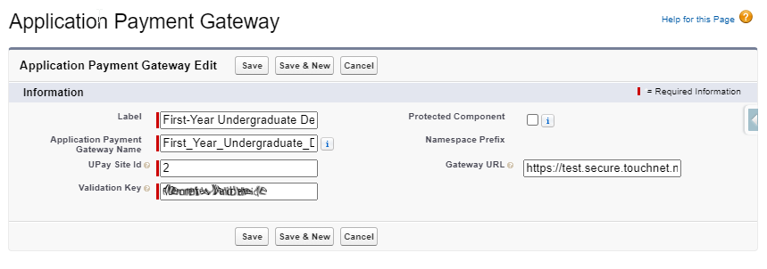

# UST Touchnet Integration

The University of St. Thomas use TouchNet Marketplace UPay sites for credit card payments of application deposits. Payemnts
are set up through a payment question in EASY with record type payment.

## Setting up custom metadata
- Go to Setup -> Custom Metadata Types in Salesforce
- Click "Manage Records" next to "Application Payment Gateway"

You can now edit existing metadata about gateways or create a new record. You will need access to the TouchNet user interface in order to fill in this data.

| Field                            | Description                                                                                                                                                   |
|----------------------------------|---------------------------------------------------------------------------------------------------------------------------------------------------------------|
 | Label                            | Plain text name of this gateway settings to differentiate it from other site ids in TouchNet. *Used on Payment Question object on the Payment Gateway field*. |
 | Application Payment Gateway Name | Auto generated by label (It can be changed, but best not to). *Used on Payment Question object on the Payment Gateway field*.                                 |
 | UPay Site Id                     | TouchNet UPay sites each have an id. Check which site your wish to use in TouchNet and put that id of that site here                                          |
 | Validation Key                   | A secret key set in your TouchNet UPay site used to encrypt a special key to allow access to the site. Create one in your UPay site and copy it here.         |
 | Protected Component              | N/A. Limits all this data to a namespace for package use.                                                                                                     |
 | Namespace prefix                 | N/A. Used for packaged applications.                                                                                                                          |
 | Gateway URL                      | This is the URL of the TouchNet gateway. Generally, we have two URLs. One for testing and one for production (actual payments)                                |

**TouchNet URLs**

Testing URL:

https://test.secure.touchnet.net:8443/C20237test_upay/web/index.jsp

Production URL:

https://secure.touchnet.com:443/C20237_upay/web/index.jsp

## Setting up a Payment Question in EASY

## Amazon Proxy used to make this all work

