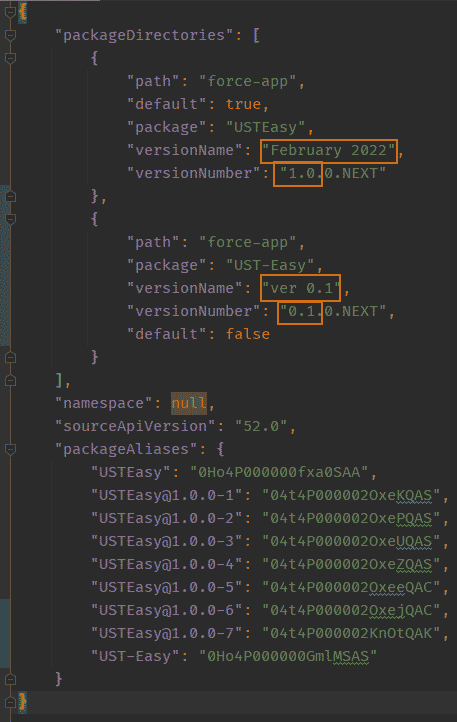

# Packaging UST-EASY

This documentation describes the process that the University of St. Thomas uses to make an unlocked
package of the UST-EASY app (University of St. Thomas' version of Enterprise Application Solution for Yield -
EASY).

[Triailhead about unlocked packages](https://trailhead.salesforce.com/en/content/learn/modules/unlocked-packages-for-customers/build-your-first-unlocked-package)

**Process**

*Step 1: Adjust version numbers in sfdx-project file*

```
sfdx force:package:version:create -p USTEasy -d force-app --installationkeybypass --skipvalidation --wait 10 -v EDA-PROD-DEV-HUB
``` 
-p : the name of the package

-d : the directory of the package code

--installationkeybypass : no secret code needed to install this package

--wait 10 : the amount of time to wait for the package to be built before recieving the notification to come back later

-v : the alias of your dev hub (it may not be EDA-PROD-DEV-HUB in your case). Your dev hub needs to be St. Thomas'
EDA prod org.

--skipvalidation : Skip the validation of the package. UST-EASY has dependent tests that rely on EDA being installed, but
package validation will baulk at this dependency.

## Org dependent packaging

[It may be better to make this an org dependent package](https://developer.salesforce.com/docs/atlas.en-us.sfdx_dev.meta/sfdx_dev/sfdx_dev_unlocked_pkg_org_dependent.htm) -
investigate this more. 

Org dependent packaging is in beta. It validates the package on install rather than pre-validating
on the creation of the package.

A package has been created in our dev hub called UST-Easy (note the dash) and the artifact
of this package is viewed in the sfdx-project.json file.

Command for making org dependent packages:

```
sfdx force:package:create -t Unlocked -r force-app -n MyPackage --orgdependent
```

## sfdx-project Anatomy

When creating a new version of a package (not a beta) you will need to increment the version number and name. Beta
packages auto increment for you and do not need to be set in this file. The version number is incremented on the first two decimal 
seperated numbers. The last decimal and the .NEXT are reserved for patches and auto beta versioning. The version name portion 
can be any string name you want. Usually Month and year is sufficient for a version name.

The following sfdx-project now is tracking two packages. One is a standard package (USTEasy) the other
is an org dependent package (UST-Easy).

The package alias section is a receipt of package ids used in an installation link. These Ids
can be retrieved later via a sfdx command so if they get deleted it isn't the end of the world.

