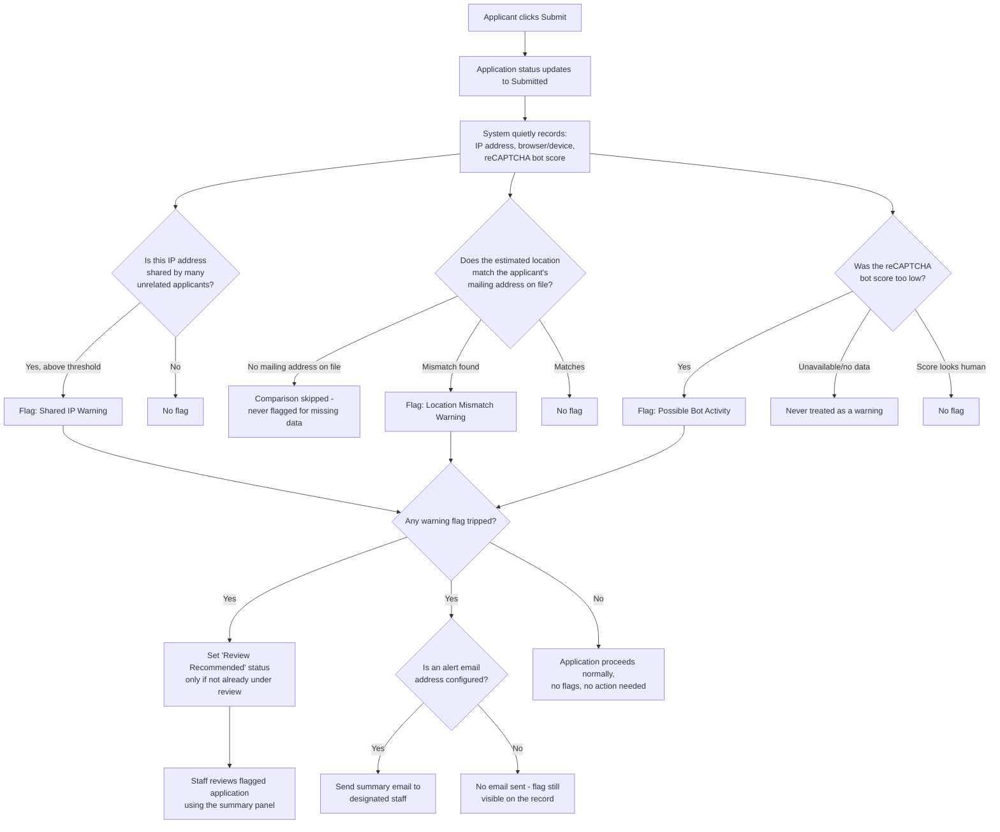
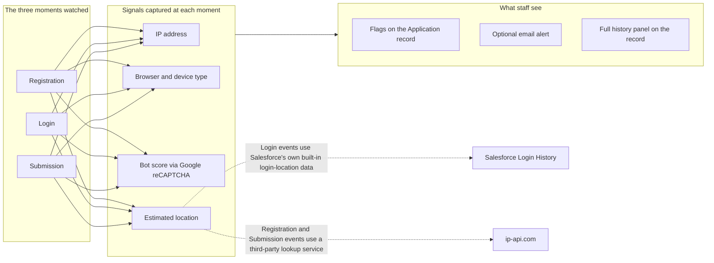

# Admissions Fraud Monitoring — Admin & Security Guide

**Audience:** Salesforce administrators, Admissions staff leads, and IT Security reviewers. No coding or Salesforce development background required to read this guide.

**Related Jira tickets:** ECRMSF-5511, ECRMSF-5529

**For developers:** see `docs/fraud-monitoring-recaptcha-ip-geo.md` for the full technical design, field-level schema, and implementation notes. This guide is the plain-language companion for people who need to understand, review, or operate the feature without reading code.

---

## 1. What problem does this solve?

The university's online admissions portal was being targeted by a fraud pattern:

1. A bad actor completes a full admissions application using stolen or fabricated identity information.
2. The application gets far enough to reach the **application fee payment step** — at which point the bad actor enters a stolen credit card number, essentially using the university's payment page to test whether the stolen card still works.
3. In some cases, the fraudulent application was accepted and the bad actor received **financial aid** before anyone caught on.
4. The real owner of the stolen card eventually notices the charge and disputes it with their bank, leaving the university to absorb the chargeback and the reputational hit.

This is a well-known fraud technique across e-commerce and educational institutions generally, not something unique to St. Thomas. The fix isn't to stop accepting applications — it's to give Admissions staff **early warning signs** so a suspicious application can be reviewed by a human before it goes any further, rather than being discovered only after money has already changed hands.

## 2. What this feature does — and does not — do

**It does:**
- Quietly collect a handful of signals every time someone registers, logs in, or submits an application through the portal.
- Compare those signals against simple rules (is this the same computer network as a bunch of other unrelated applicants? Does the applicant's claimed home address match where they're actually connecting from?).
- Flag anything unusual on the application record, and optionally email a designated staff distribution list when something looks off.

**It does not:**
- Block, deny, delay, or auto-reject any application, login, or registration, ever, under any circumstance.
- Make any final judgment about whether something is actually fraud. Every flag raised by this system is a *suggestion to a human reviewer*, not a verdict.
- Collect anything beyond what a normal website already sees when you visit it (IP address, browser type, rough geographic location from that IP, etc.) — no additional personal information, no biometrics, no device fingerprinting beyond standard web-browser signals.

This is a deliberate design choice, confirmed with the business stakeholder before any of this was built. **International applicants, students using a VPN, students traveling, and students in a shared environment like a public library or a campus computer lab can all legitimately trigger one of these flags without doing anything wrong.** The system is built around that reality — a flag is a prompt to "take a closer look," not an accusation.

## 3. The three moments this feature watches

Every time one of these three things happens on the portal, the system quietly records a snapshot:

| Event | What the applicant is doing |
|---|---|
| **Registration** | Creating a brand-new account for the first time |
| **Login** | Signing back in to an existing account |
| **Submission** | Clicking the final "Submit" button on a finished application |

**Why all three, and not just registration?** Because a bad actor doesn't have to be the same person who registered the account. If an applicant's login credentials get stolen or guessed later, or if someone hijacks an already-logged-in session, the fraud could happen well after a perfectly legitimate registration. Watching every login and every submission — not just the very first sign-up — closes that gap.

## 4. What gets collected at each of those moments

At each of the three moments above, the system captures a small snapshot of information that any website already receives automatically when a browser connects to it:

- **The visitor's IP address** — the "network address" their internet connection is using, similar to a mailing address for internet traffic. This is the same information any website's server logs would show.
- **A rough geographic location derived from that IP address** — typically city, state/region, and country. This is an estimate, not GPS-precise, and can be wrong for travelers, VPN users, or mobile carriers that route traffic through a different city.
- **Browser and device information** — is this Chrome, Safari, Firefox? Windows, Mac, iPhone? Is it a phone, tablet, or computer? This is the same information every website sees in a standard, non-invasive way (it's literally part of how your browser identifies itself when it asks a website for a page).
- **A "bot score" from Google reCAPTCHA** — a widely-used, industry-standard service that estimates how likely a given visit is to be a real human versus an automated script/bot, on a scale from 0 (looks like a bot) to 1 (looks like a real person). This runs invisibly in the background — there are no "click the checkbox" or "select all the traffic lights" puzzles for the applicant to solve.

None of this is unusual or invasive for a modern website. What's new here isn't the *type* of information — it's that the system now **keeps a permanent record of it, tied to each application,** so staff can look back and connect the dots later, and it runs a couple of automated comparisons rather than requiring staff to manually check things themselves.

### A note on Google reCAPTCHA and cost

This uses Google's **free** tier of reCAPTCHA v3. The free tier has a monthly usage limit. If that limit is ever exceeded (for example, during a high-traffic admissions deadline week), the bot-detection part of this system will simply report **"unavailable"** for the rest of that period — it will never guess, never assume the worst, and never block anyone just because the free quota ran out. Leadership can decide later, based on real usage data, whether upgrading to Google's paid tier is worth the cost. Nothing about this feature depends on that decision being made right away.

## 5. The three warning signs the system checks for

### Warning sign #1: "This looks like a bot, not a person"

Google's reCAPTCHA score (see above) is compared against an admin-adjustable threshold. If reCAPTCHA reports a *low* score (closer to "bot-like") on a submission, that's logged as a signal.

**Important:** if reCAPTCHA is unavailable for any reason (free quota exhausted, Google's service is briefly down, a network hiccup), this is treated as **no data**, never as "definitely a bot." An unavailable score can never, by itself, cause a warning.

### Warning sign #2: "A lot of unrelated people are applying from the exact same internet connection"

The system counts how many *different* applicants have submitted an application from the same IP address in the last 30 days. If that count crosses an admin-adjustable threshold, it's flagged.

**Why this matters:** if fifteen unrelated applications are all coming from the same internet connection in a short window, that's a pattern worth a second look — it can indicate a coordinated fraud attempt using a shared device or network.

**Why this can be a false positive:** a school counselor's office, a public library, a campus computer lab, or a busy household with several kids applying to college could all trigger this completely innocently. That's exactly why this only creates a *flag for review*, never an automatic rejection.

### Warning sign #3: "Where they're applying from doesn't match where they say they live"

The system compares the geographic location estimated from the submission's IP address against the mailing address the applicant has on file (city, state, and country). If none of those match, it's flagged.

**Deliberately built to avoid a specific false-positive trap:** if an applicant hasn't filled in a mailing address yet (common for a brand-new applicant who hasn't gotten that far in the process), this comparison is **skipped entirely** — no address on file means there is nothing to compare against, and the system does not treat "no address" as "far away." This was a real design consideration during development, called out specifically so international applicants and students early in the application process aren't unfairly flagged just for not having filled out every field yet.

**Why this can be a false positive:** students studying abroad, international applicants, students who moved and haven't updated their address yet, or anyone using a VPN could trigger this without anything being wrong.

## 6. What happens when a warning sign is triggered

When any of the three warning signs above trips on a submission:

1. A checkbox flag is set directly on the Application record (so any staff member looking at the application in Salesforce sees it immediately, no digging required).
2. **If** the university has configured a distribution list of staff email addresses to notify (this is optional and admin-configurable — see Section 8), an email alert goes out summarizing which signal(s) tripped and why.
3. The application's review status is set to **"Review Recommended"** — but only if nobody is already actively working the application. If a staff member already has it under review, the system will never silently overwrite or reset their progress.

None of this blocks, pauses, or delays the applicant's actual submission. From the applicant's point of view, nothing changes — their application goes through exactly as it would have without this feature. The only difference is invisible to them: a staff member now has a heads-up to take a closer look.

## 7. Where staff see this information

Every Admissions Application record in Salesforce can show a summary panel (a small dashboard) directly on the record, showing:

- Whether the Shared-IP warning or Location-Mismatch warning is currently active
- The current review status (e.g., "Review Recommended")
- A history table of every registration, login, and submission event recorded for that application, including the timestamp, the reCAPTCHA score at the time, the IP address, the estimated location, and browser/device details

This gives a reviewing staff member a complete picture in one place, without needing to dig through multiple screens or ask IT for help pulling logs.

## 8. What administrators can tune, without needing a developer

Several thresholds are intentionally left as simple configuration settings rather than being hardcoded, so an admin can adjust them as real-world experience accumulates — no code changes or developer involvement required:

| Setting | What it controls |
|---|---|
| Shared-IP count threshold | How many unrelated applicants sharing one IP address is "too many" before it's flagged |
| reCAPTCHA score threshold | How low a bot-detection score has to be before it counts as a warning sign |
| Fraud alert email recipients | Which staff email addresses (if any) get notified when a warning trips |

### What happens if the fraud-monitoring system itself has a problem?

Like any automated system, the pieces that evaluate warning signs and send alert emails could, in rare cases, run into a technical problem of their own — for example, a temporary data issue, or an email that can't be delivered. Two things are guaranteed even if that happens:

1. **The applicant is never affected.** The fraud-monitoring checks run in the background, completely separately from the applicant's actual registration, login, or submission. A problem in the background checking process cannot cause an applicant's action to fail or be delayed.
2. **A technical failure leaves a visible trail.** If the automated review itself runs into trouble, the system records what went wrong directly on the affected Application record (in a dedicated diagnostic field, separate from staff notes) and — if a technical contact address has been configured — sends a notification so IT or an admin can look into it, rather than the problem going unnoticed.

In short: the system is built with two independent safety nets — one designed to notify staff proactively when something in the automated process breaks, and a second, unconditional guarantee that applicants are never blocked no matter what happens on the monitoring side.

These live in a standard Salesforce settings record that an admin can open and edit directly, the same way they'd update any other configuration value in the org — no deployment, no developer, no waiting on an IT ticket.

## 9. Data retention and privacy notes for security review

- **No new categories of personal data are collected.** Everything captured (IP address, rough location derived from IP, browser/device type, a bot-likelihood score) is standard web-server-visible information that any website receives automatically — nothing here requires special consent flows beyond what a normal web visit already implies.
- **No biometric data, no device fingerprinting beyond standard browser identification, no third-party tracking cookies** are used.
- **The bot-detection score comes from Google reCAPTCHA**, a widely deployed, industry-standard service used across a large fraction of the web (login forms, comment sections, checkout pages, etc.). St. Thomas is using Google's free tier.
- **The geographic-location lookups for registration and application-submission events use a third-party service called ip-api.com**, which converts an IP address into an estimated city/region/country. This is a common, non-invasive category of service (many websites use similar IP-to-location providers for things like currency display or language defaults). Salesforce's *own* built-in login-tracking data is used instead for the login-event geolocation, so no third-party lookup happens for that particular event type.
- **All of this data is retained as long as the underlying Application record exists** in Salesforce, subject to the university's normal Salesforce data-retention and records-management policies — this feature does not introduce any new retention rules of its own.
- **Access to this data in Salesforce is permission-controlled** like any other Salesforce data: the audit history described in Section 7 is visible to Admissions staff with appropriate permissions, and the raw signal data is not exposed anywhere outside Salesforce.

## 10. Detection flow at a glance

The diagram below shows what happens, step by step, for a single application submission (registration and login follow the same overall shape, just without the mailing-address comparison).

## 11. Where each signal comes from, at a glance

## 12. Frequently asked questions

**Does this slow down the applicant's experience at all?**
No. All of the fraud-monitoring work happens in the background, after the applicant's action (registering, logging in, or submitting) has already completed. If anything in this system is temporarily unavailable — Google's reCAPTCHA service, the location-lookup service, or anything else — the applicant is never kept waiting and never sees an error because of it.

**Can this ever reject or block a real, legitimate applicant?**
No. This system has no ability to reject, block, deny, or delay anything. Every single output of this system is either "no flag" or "flag this for a human to look at." There is no automatic denial path anywhere in this design.

**What happens if Google's free reCAPTCHA quota runs out during a high-traffic period, like a deadline day?**
The bot-detection portion of the system will report "unavailable" for the rest of the quota period. This is explicitly treated the same as "no information available" — never as a red flag. Nothing else in the system (the shared-IP check and the location-match check) depends on reCAPTCHA at all, so those two checks keep working normally regardless.

**Who can see the fraud-monitoring information on an application?**
The same staff who already have permission to view and work Admissions Applications in Salesforce. This feature doesn't introduce a new, separate audience with special access — it surfaces information within the existing permission model.

**Does this feature comply with data privacy expectations?**
Everything collected here is standard, non-invasive information any website already receives when a browser visits it (network address, browser type, and a rough IP-based location estimate). No biometric data, no special-category personal data, and no additional consent mechanisms beyond a normal website visit are introduced. See Section 9 for the full privacy/security summary.

**What if an admin wants to make the warnings more or less sensitive?**
The three key thresholds — how many shared applicants trigger the "shared IP" warning, how low a bot score has to be to count as suspicious, and who gets notified by email — are all editable directly in a standard Salesforce settings record by any admin, without needing a developer or a deployment. See Section 8.

**Is any of this feature specific to St. Thomas, or is it a standard approach?**
The overall strategy — behind-the-scenes bot detection, IP/location signals, and shared-IP pattern detection — is a widely-used, standard approach across many industries dealing with online fraud (e-commerce, banking, ticketing, and higher-ed admissions all use variations of this). Nothing about the underlying techniques is unusual or experimental; what's specific to St. Thomas is which signals were chosen, how the thresholds are tuned, and the explicit decision to never auto-block.
